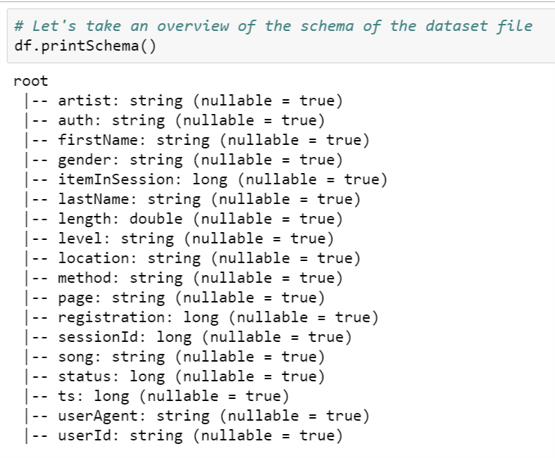

<!-- PROJECT LOGO -->
<br />
<p align="center">
  <a href="https://github.com/inmaugarc/DataScienceCapstone">
    
  </a>

  <h3 align="center">Data Science Capstone Sparkify Project</h3>

  <p align="left">
    Sparkify is an imaginary streaming music service, similar to Spotify or Pandora, where users listen to music with a free or a paid subscription plan. With the free plan, the user has to listen to advertising between songs. With the paid subscription, the user doesn't listen advertising between songs and also they can choose the song they want to listen to.
<br>The goal of this project is predicting if a user will churn or not of our Music Streaming Sparkify service.
    <br />
    <a href="https://github.com/inmaugarc/DataScienceCapstone"><strong>Explore the docs »</strong></a>
    <br />
    <br />
    <a href="https://github.com/inmaugarc/DataScienceCapstone">View Demo</a>
    ·
    <a href="https://github.com/inmaugarc/DataScienceCapstone/issues">Report Bug</a>
    ·
    <a href="https://github.com/inmaugarc/DataScienceCapstone/issues">Request Feature</a>
  </p>
</p>


<!-- TABLE OF CONTENTS -->
<details open="open">
  <summary><h2 style="display: inline-block">Table of Contents</h2></summary>
  <ol>
    <li>
      <a href="#about-the-project">About The Project</a>
    </li>
    <li>
      <a href="#getting-started">Getting Started</a>
      <ul>
        <li><a href="#installation">Installation</a></li>
      </ul>
    </li>
    <li><a href="#usage">Usage</a></li>
    <li><a href="#roadmap">Data Schema</a></li>
    <li><a href="#roadmap">Graphic Exploration</a></li>
    <li><a href="#contributing">Contributing</a></li>
    <li><a href="#license">License</a></li>
    <li><a href="#contact">Contact</a></li>
    <li><a href="#acknowledgements">Acknowledgements</a></li>
  </ol>
</details>


<!-- ABOUT THE PROJECT -->
## About The Project
With this project you will practice to manipulate large datasets with Spark and engineer features to predict if a user will churn. 
Also you will learn how to use Spark MLlib to prepare machine learning models and apply them to large datasets.
Predicting churn is a problem that can be encountered all over the businesses. 

<!-- GETTING STARTED -->
## Getting Started

To get a local copy up and running follow these simple steps.
The main component is the file Sparkify.ipynb that is Jupyter Notebook that contains the code.
The data source is in the file mini_sparkify_event_data.7zip, that you'll need to extract.


### Installation

1. Clone the repo
   ```sh
   git clone https://github.com/inmaugarc/DataScienceCapstone.git
   ```
2. Unzip data files from mini_sparkify_event_data.7zip


<!-- USAGE EXAMPLES -->
## Usage

Open a Jupyter Notebook and start running the code cells!

<!-- PROJECT STEPS -->
## Steps
These are the steps of this project

First of all, I have uploaded the data into Spark.
After that, I have done an Exploratory Data Analysis.
As a third step, I have managed the nulls values and made some transformations.
I have prepared the features that are important to determine if a user will churn or not.
Then I have build the models and finally I have trained and test the models.


<!-- DATA SCHEMA -->
## Data Schema
This is the schema of the data format


<!-- GRAPHIC EXPLORATION -->
## Graphic Exploration
Let's see some graphics to understand the problem
<br />
Is there any gender-related trend that could influence in churning?
<br />

<br />Is there any difference between the OS of the device the user connects to our service from, and the type of subscription?

<br />What are the common activities a user does in our Sparkify music streaming service?

<br />Has the location of a user an influence on the type of subscription?

<br /> Is there a difference in membership time between the users who churned and who did not churn?


<!-- CONTRIBUTING -->
## Contributing

Contributions are what make the open source community such an amazing place to learn, inspire, and create. Any contributions you make are **greatly appreciated**.
See the [open issues](https://github.com/inmaugarc/DataScienceCapstone/issues) for a list of proposed features (and known issues).

1. Fork the Project
2. Create your Feature Branch (`git checkout -b feature/AmazingFeature`)
3. Commit your Changes (`git commit -m 'Add some AmazingFeature'`)
4. Push to the Branch (`git push origin feature/AmazingFeature`)
5. Open a Pull Request


<!-- LICENSE -->
## License

Distributed under the MIT License. See `LICENSE` for more information.


<!-- CONTACT -->
## Contact

Inma - [@linkedin](https://linkedin.com/in/inmaugarc) - inmaugarc@yahoo.es

Project Link: [https://github.com/inmaugarc/DataScienceCapstone](https://github.com/inmaugarc/DataScienceCapstone)
Project BlogPost:[https://inmaug.medium.com/To Churn or not to Churn-a377bb161c5b](https://inmaug.medium.com/To Churn or not to Churn-a377bb161c5b)


<!-- ACKNOWLEDGEMENTS -->
## Acknowledgements
Acknowledgements and thanks to Udacity for creating a real big data project with practical application in several digital businesses.
<br />Also I got inspiration from Kaggle: https://www.kaggle.com/
<br />I used in several occasions Stackoverflow when I needed help with errors: https://stackoverflow.com/
<br />And I got information from Spark ML documentation http://spark.apache.org/docs/latest/ml-guide.html


<!-- MARKDOWN LINKS & IMAGES -->
<!-- https://www.markdownguide.org/basic-syntax/#reference-style-links -->
[linkedin-url]: https://linkedin.com/in/inmaugarc

